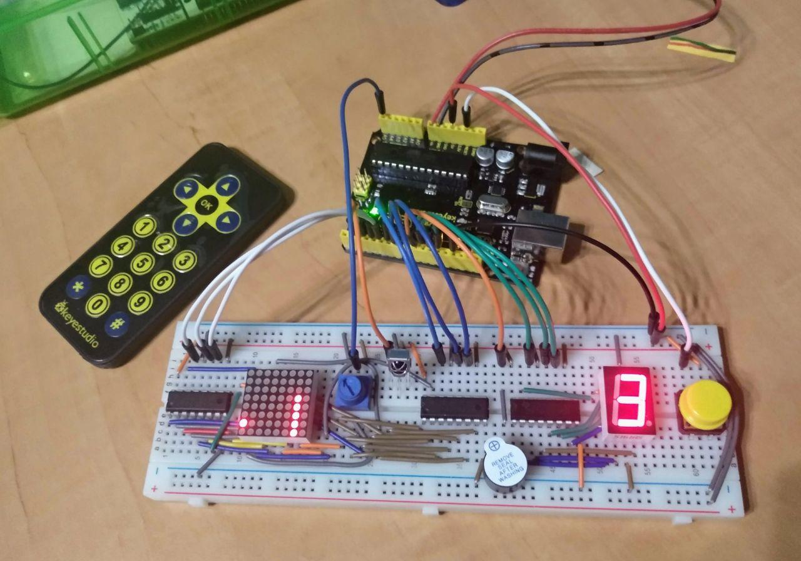

# Arduino Snake Game

This is a version of Snake Game built using

- Arduino Uno
- 8x8 LED matrix
- IR remote control & IR receiver
- 3 8-bit shift registers 
- 7-segment display
- Active buzzer
- 10KΩ potentiometer
- Button, breadboard, and a lot of jumper wires

## Features

- Full control of the snake done wirelessly with an IR remote.
- Counts the score on a 7-segment display (upto 9).
- Displays sad face on GameOver, happy face on Win.
- Buzzer squeaks each time snake grows.
- Game restarts on button press.
- Refresh rate of the LED matrix is adjustable via the potentiometer.

**Dependencies**

- `arduino-cli` or an [Arduino IDE](https://www.arduino.cc/en/main/software)
- [IRremote](https://www.arduinolibraries.info/libraries/i-rremote) Arduino library

## Demo

Demo video: https://imgur.com/gallery/sp1lTtw

